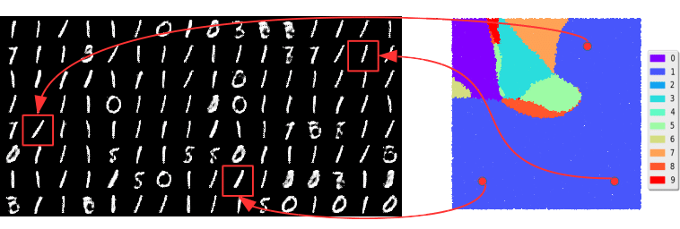

While incredibly powerful, [GANs](./2021-12-22t11-42-44z.md) can be particularly
difficult to train. Here are some of the issues

- **Nash equilibrium is hard to achieve**. This is the essentially the balance
  in performance between the discriminator and generator. Since we optimize one
  player at a time, one will always lead and we never reach convergence. Ideally
  we would want our discriminator and generator to tie.
- [**vanishing gradients**](./2021-04-23t16-08-52z.md)
  - When the discriminator reaches optimal performance, the gradients vanish,
    and learning stops. While not problematic on its own, this becomes an issue
    when we consider that the discriminator is easier to train than the
    generator, which could cause such a situation to occur early during
    training.
  - Likewise, if the discriminator is quite bad, little feedback is provided to
    the generator, which does not learn.
  - **Mode collapse**: The generator starts specializing on a small subset of
    data, achieving high performance, since there is no penalty for lack of
    generation variety. 
  - [**JS Divergence is not suitable**](./2021-12-22t15-06-55z.md): this is an
    issue of vanilla GANs that is addressed by Wasserstein GANs (see linked
    note).
