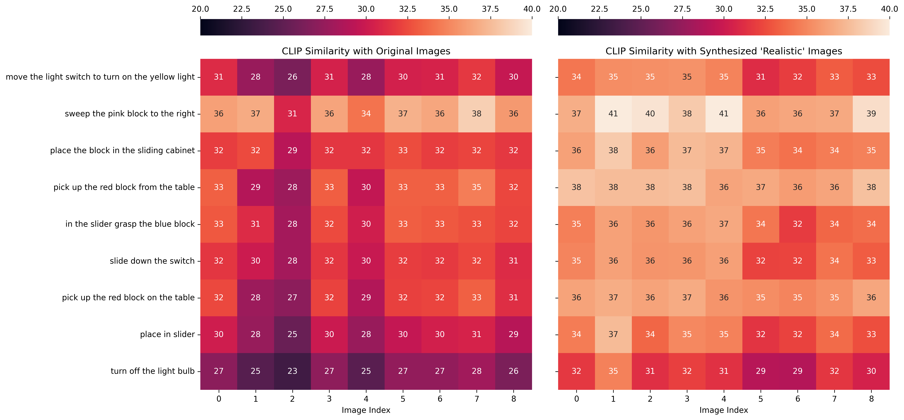
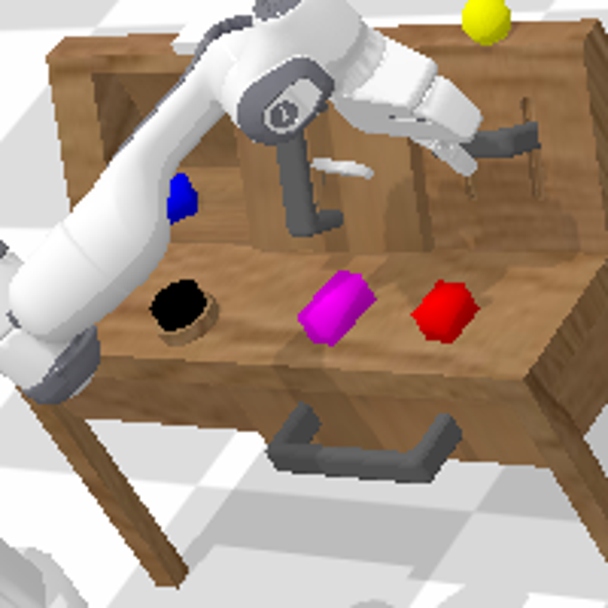
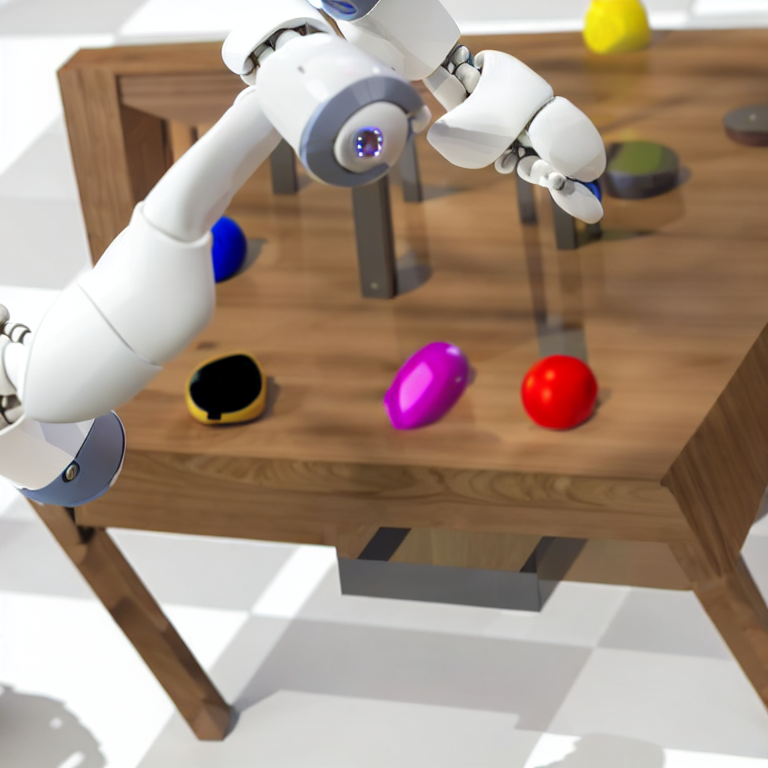

We posit that the RGB images of the [[CALVIN]] environment state are out of
distribution when compared to the images CLIP was trained on.

We do a quick check by doing style transfer on a sample of images from the
environment, converting them to be more realistic using [[diffusion]] models.

We do this using an img2img model conditioned on the following prompt:
"Photograph of robotic arm interacting with wooden table top. Canon 60D.
Realistic, HD, 8k, ultra detailed".

We then check the similarity with textual annotations, and find that this
similarity is higher for the "realistic" images, indicating that indeed the
original images were slightly out of distribution

See below for an example before and after.

