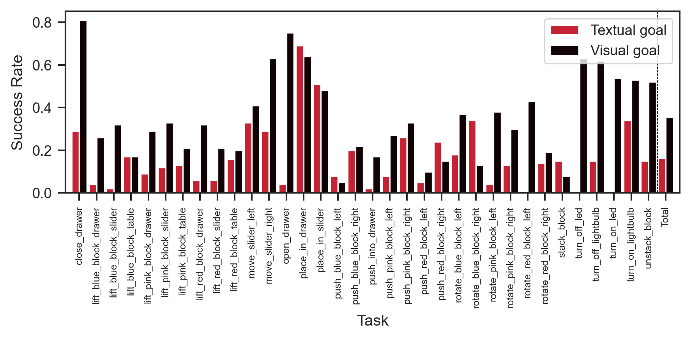

For [GCBC evaluation](./2023-07-11t10-52-26z.md), the
[checkpoint where the validation loss is lowest](./2023-07-11t11-24-40z.md)
occurs quite early on in training, and the
[training loss has not yet fully plateaued](./2023-07-11t10-48-13z.md).

Taking the checkpoint from the end of training gives the following results:

|       | Textual Success Rate | Visual Success Rate |
| ----- | -------------------- | ------------------- |
| count | 34.000000            | 34.000000           |
| mean  | 0.163235             | 0.354118            |
| std   | 0.151971             | 0.199729            |
| min   | 0.000000             | 0.050000            |
| 25%   | 0.052500             | 0.202500            |
| 50%   | 0.135000             | 0.320000            |
| 75%   | 0.230000             | 0.510000            |
| max   | 0.690000             | 0.810000            |

We note an improvement in both textual and visual performance, indicating that
there is still space for training and that validation loss may not be the right
metric for early stopping here. We note that the
[gap](./2023-07-11t11-38-00z.md) is still there.
