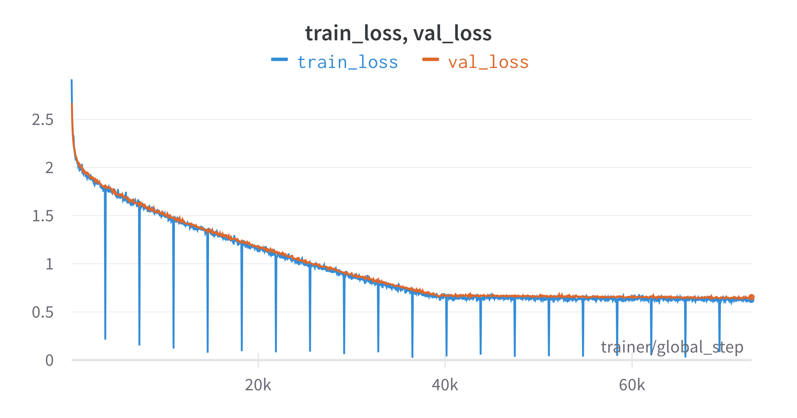

When using [precomputed CLIP embeddings](./2023-07-13t00-50-10z.md), training of
[CLIPT](./2023-07-10t16-36-37z.md) and [CCLIPT](./2023-07-11t11-38-00z.md) is
actually very rapid, since we are only fine-tuning small MLP heads.

Previous experiments relied on checkpoints trained for 50 epochs, in less than
10 minutes. The training curves however did not show signs of plateauing, so we
decide to train CCLIPT from scratch, training for a full hour, for a total of
almost 1000 epochs. Our curves ultimately plateau

