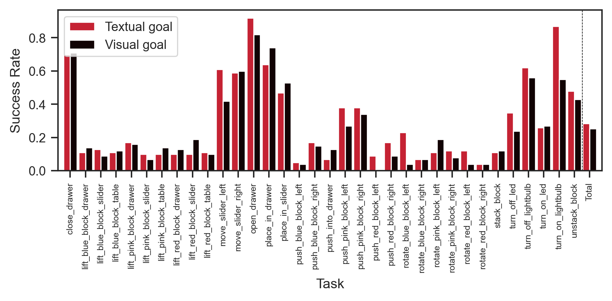
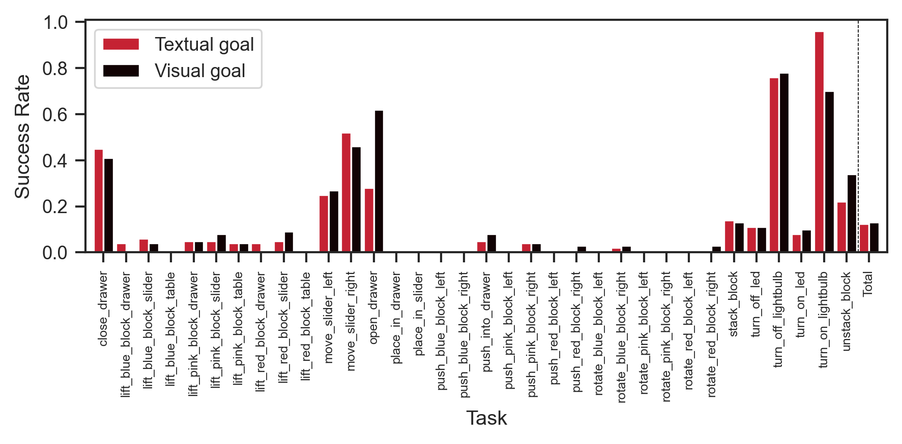
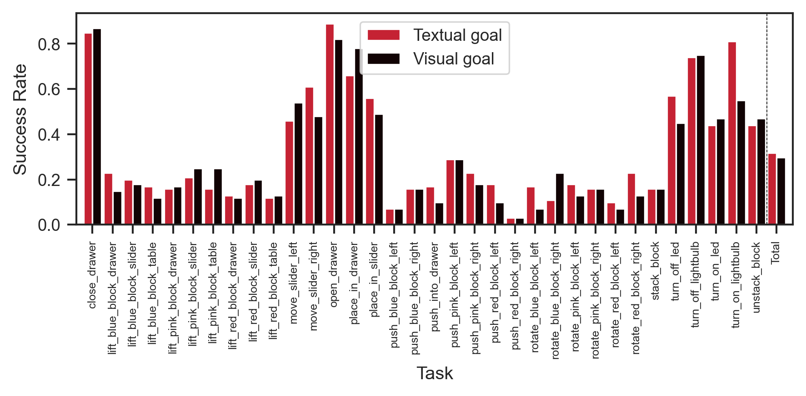
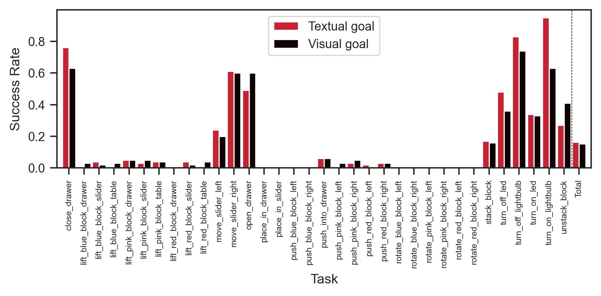
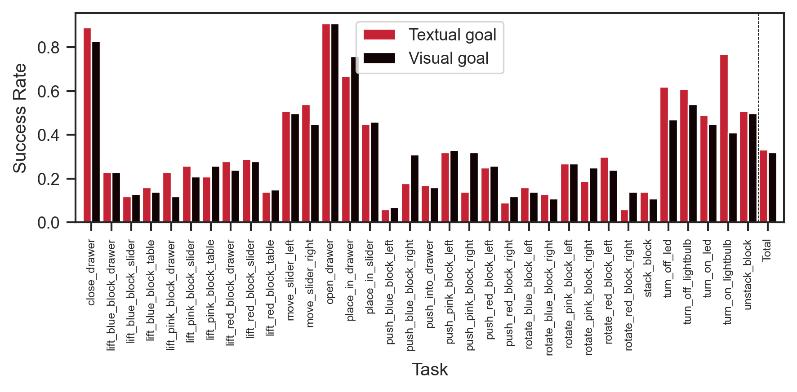
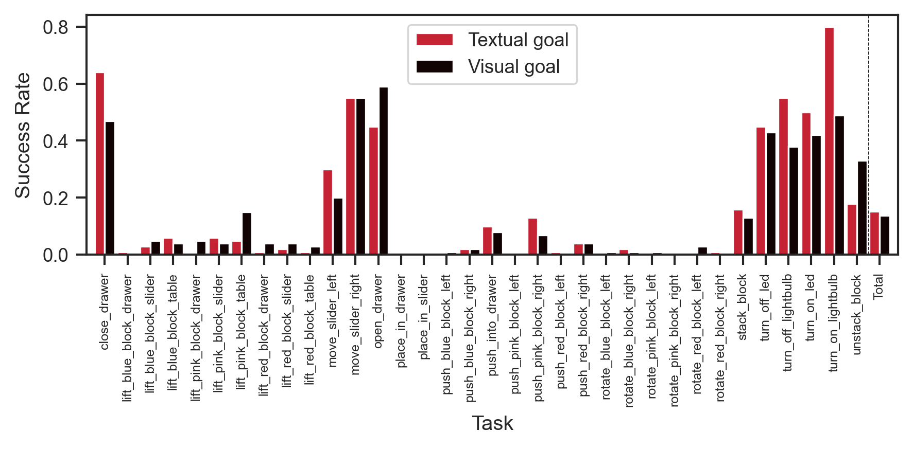

Having [fully trained](./2023-07-12t13-47-41z.md)
[CCLIPT](./2023-07-11t11-38-00z.md), and seeing promising results from
[GCBC evaluations with preliminary versions of CCLIPT](./2023-07-11t11-38-00z.md),
we now re-train and re-evaluate [GCBC](./2023-07-11t10-17-09z.md) with this
CCLIPT backend.

We imagine that this will help with overall performance and
[gap issue](./2023-07-11t11-38-00z.md), but will not necessarily address the
[suggestive start states problem](./2023-07-11t12-12-49z.md).

Below we find the evaluation results with suggestive start states, at the
various checkpoints:

## Third checkpoint (1.5 epochs)

|       | Textual Success Rate | Visual Success Rate |
| ----- | -------------------- | ------------------- |
| count | 34.000000            | 34.000000           |
| mean  | 0.283824             | 0.253529            |
| std   | 0.252659             | 0.230084            |
| min   | 0.040000             | 0.010000            |
| 25%   | 0.102500             | 0.090000            |
| 50%   | 0.150000             | 0.145000            |
| 75%   | 0.447500             | 0.400000            |
| max   | 0.920000             | 0.82000             |

And without suggestive start states

|       | Textual Success Rate | Visual Success Rate |
| ----- | -------------------- | ------------------- |
| count | 34.000000            | 34.000000           |
| mean  | 0.124706             | 0.131765            |
| std   | 0.226398             | 0.215399            |
| min   | 0.000000             | 0.000000            |
| 25%   | 0.000000             | 0.002500            |
| 50%   | 0.040000             | 0.035000            |
| 75%   | 0.102500             | 0.107500            |
| max   | 0.960000             | 0.780000            |

We see that the average visual performance is lower than
[GCBC trained with normal CLIPT](./2023-07-11t11-24-40z.md), and lower in terms
of both visual and textual performance when compared to the
[GCBC trained with frozen vision FT CCLIPT](./2023-07-11t11-38-00z.md).

That being said, these are curves from the third checkpoint, and we have not yet
evaluated the later checkpoints, which will hopefully improve overall
performance.

The gap is mostly solved, and if anything textual performance is higher.

Finally, we note that some tasks appear to be much easier for the model than
others. It is unclear if this is an instance of mode collapse, under-training or
that the tasks are actually harder.

## Ninth checkpoint (4.5 epochs)

|       | Textual Success Rate | Visual Success Rate |
| ----- | -------------------- | ------------------- |
| count | 34.000000            | 34.000000           |
| mean  | 0.318529             | 0.297647            |
| std   | 0.246898             | 0.240392            |
| min   | 0.030000             | 0.030000            |
| 25%   | 0.160000             | 0.130000            |
| 50%   | 0.190000             | 0.180000            |
| 75%   | 0.455000             | 0.470000            |
| max   | 0.890000             | 0.870000            |

|       | Textual Success Rate | Visual Success Rate |
| ----- | -------------------- | ------------------- |
| count | 34.000000            | 34.000000           |
| mean  | 0.162941             | 0.152059            |
| std   | 0.269596             | 0.231383            |
| min   | 0.000000             | 0.000000            |
| 25%   | 0.002500             | 0.010000            |
| 50%   | 0.030000             | 0.030000            |
| 75%   | 0.222500             | 0.190000            |
| max   | 0.950000             | 0.740000            |

Performance has improved, but only by a little bit. Worryingly the suggestive
start state problem does seem to benefit much from additional training.

## Final checkpoint (10 epochs)

|       | Textual Success Rate | Visual Success Rate |
| ----- | -------------------- | ------------------- |
| count | 34.000000            | 34.000000           |
| mean  | 0.333824             | 0.319706            |
| std   | 0.236502             | 0.210835            |
| min   | 0.060000             | 0.070000            |
| 25%   | 0.160000             | 0.142500            |
| 50%   | 0.255000             | 0.260000            |
| 75%   | 0.505000             | 0.450000            |
| max   | 0.910000             | 0.910000            |

|       | Textual Success Rate | Visual Success Rate |
| ----- | -------------------- | ------------------- |
| count | 34.000000            | 34.000000           |
| mean  | 0.151765             | 0.138529            |
| std   | 0.227988             | 0.189099            |
| min   | 0.000000             | 0.000000            |
| 25%   | 0.002500             | 0.010000            |
| 50%   | 0.025000             | 0.040000            |
| 75%   | 0.175000             | 0.187500            |
| max   | 0.800000             | 0.590000            |

We don't see particular improvements over the previous problems.
