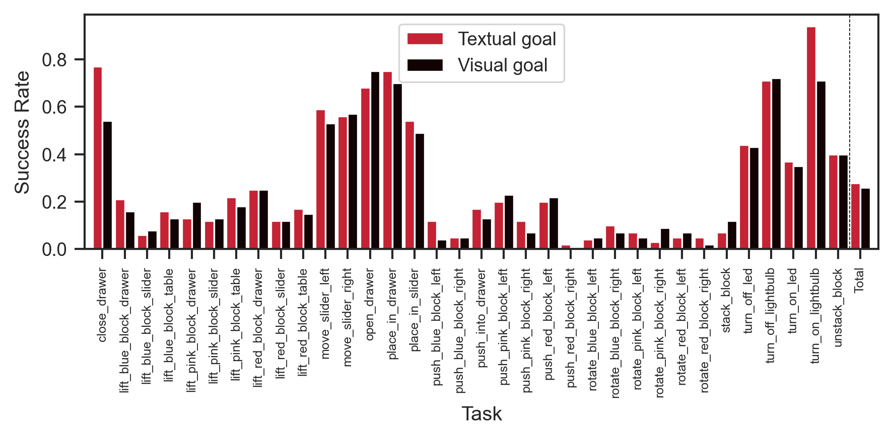
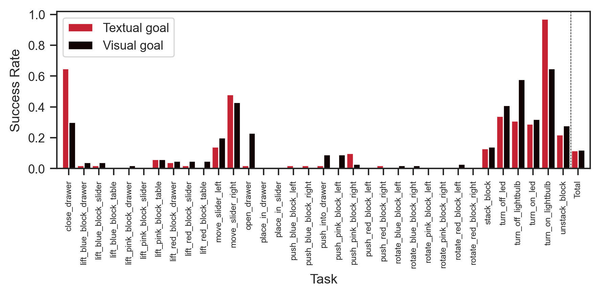

## First checkpoint (1 epoch)

With suggestive start states:

|       | Textual Success Rate | Visual Success Rate |
| ----- | -------------------- | ------------------- |
| count | 34.000000            | 34.000000           |
| mean  | 0.278824             | 0.258824            |
| std   | 0.260114             | 0.233858            |
| min   | 0.020000             | 0.000000            |
| 25%   | 0.077500             | 0.072500            |
| 50%   | 0.170000             | 0.155000            |
| 75%   | 0.430000             | 0.422500            |
| max   | 0.940000             | 0.750000            |

And without suggestive start states:

|       | Textual Success Rate | Visual Success Rate |
| ----- | -------------------- | ------------------- |
| count | 34.000000            | 34.000000           |
| mean  | 0.117059             | 0.122353            |
| std   | 0.215175             | 0.175811            |
| min   | 0.000000             | 0.000000            |
| 25%   | 0.010000             | 0.010000            |
| 50%   | 0.020000             | 0.040000            |
| 75%   | 0.122500             | 0.185000            |
| max   | 0.970000             | 0.650000            |

Compared to [static trajectories with CCLIPT](2023-07-13t17-03-51z.md),
[rolling trajectories](2023-07-11t12-33-17z.md) don't seem to help much with any
of our problems i.e.:

- overall accuracy.
- [gap between textual and visual](2023-07-11t11-38-00z.md).
- [suggestive and non-suggestive](2023-07-11t12-12-49z.md) start states.

## TODO:

- [ ] Train for longer before complete abandonment?
