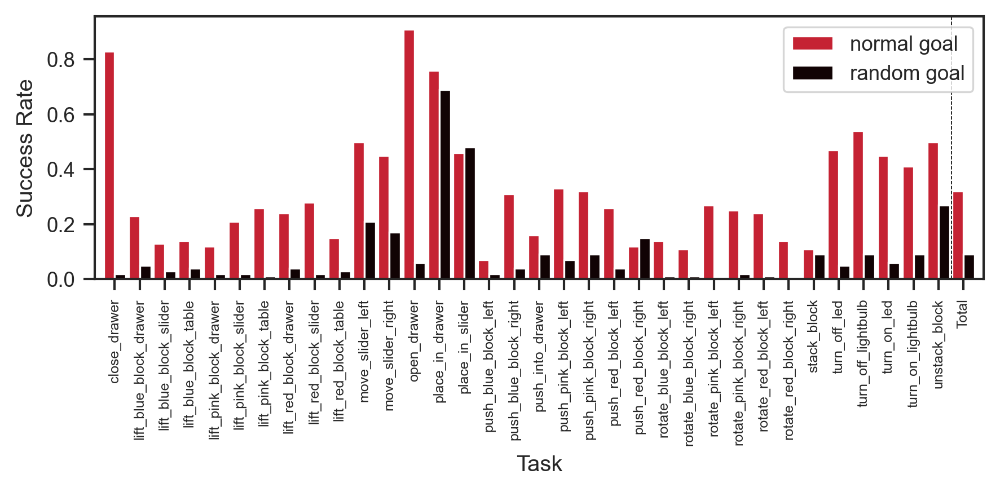

We previously
[checked whether CCLIPT was ignoring the second half of its inputs](2023-07-11t12-32-21z.md).

We now perform an ablation to check whether [GCBC](./2023-07-11t10-17-09z.md) is
ignoring its conditioning and just relying on the current state, essentially
performing vanilla [[behavioural cloning]].

To do this, we repeat [GCBC evaluation](./2023-07-11t10-52-26z.md) with the
trajectory embeddings replaced with random vectors of the same dimension. If
GCBC is indeed ignoring the trajectory conditioning and just performing vanilla
behavioural cloning, then we should not observe any drop in performance between
the ablation and the standard setting.

|       | Normal Success Rate | Random Success Rate |
| ----- | ------------------- | ------------------- |
| count | 34.000000           | 34.000000           |
| mean  | 0.319706            | 0.090882            |
| std   | 0.210835            | 0.141708            |
| min   | 0.070000            | 0.000000            |
| 25%   | 0.142500            | 0.020000            |
| 50%   | 0.260000            | 0.040000            |
| 75%   | 0.450000            | 0.090000            |
| max   | 0.910000            | 0.690000            |

We see a significant drop in performance, suggesting that it is unlikely that
GCBC is ignoring the conditioning.
