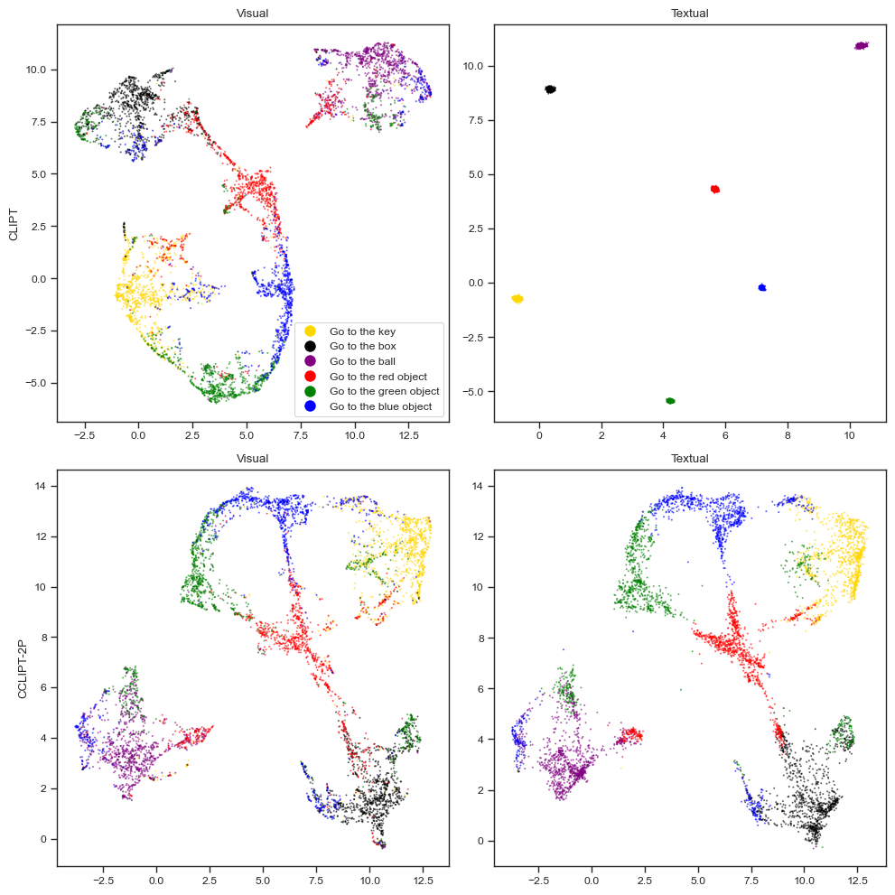
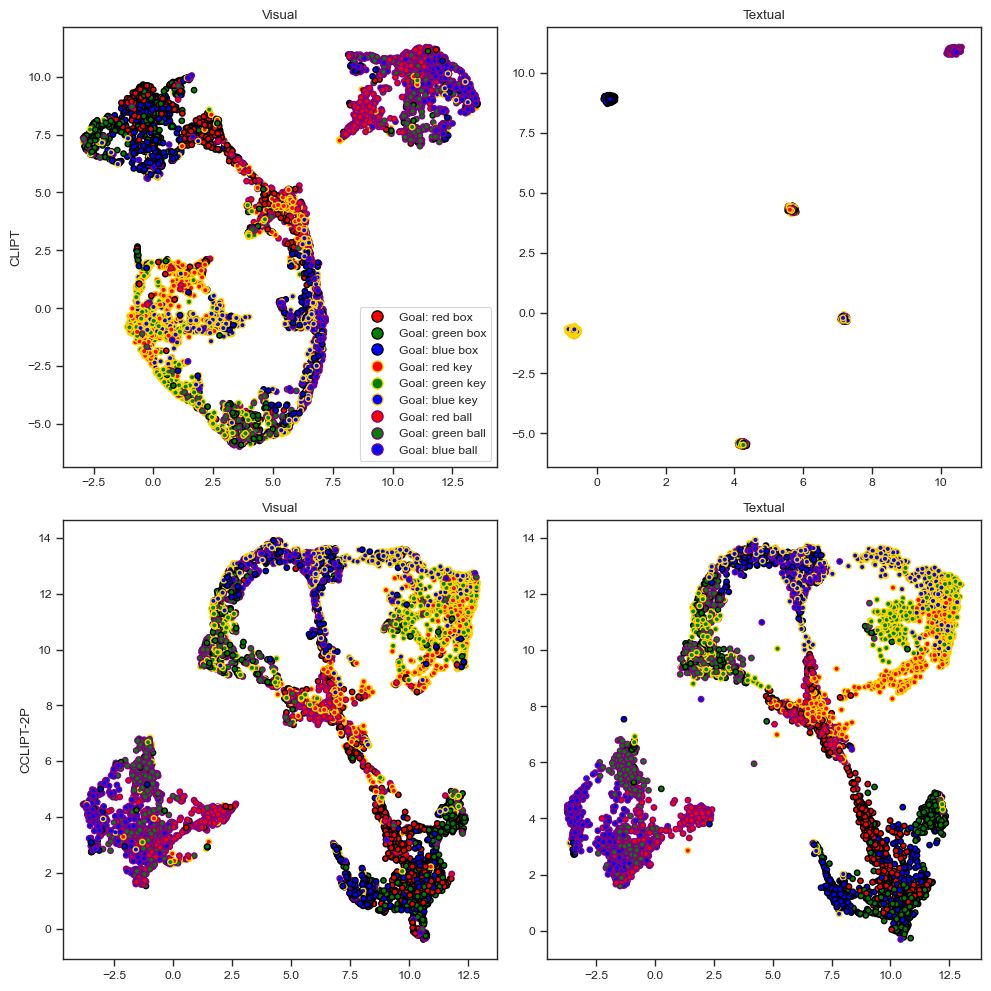

As shown in the [goal misgeneralisation results](2023-08-10t10-40-36z.md), our [[2023-07-11t10-17-09z|GCBC]] policy curtails the issue of [[2023-07-10t14-38-57z|goal misgeneralization]] when compared to [[Reward-Conditioned behavioural cloning]], however goal misgeneralization is still occurring.

This could be due to the policy not being powerful enough to pick up structure in the [[2023-07-10t16-36-37z|CLIPT]] embeddings, or due to sub-par CLIPT embeddings, which don't properly disentangle object types from object colours.

We investigate this by visualizing the trajectory embeddings, which we can achieve by reducing their dimensionality to 2 or 3. We do this by using [UMAP]([UMAP: Uniform Manifold Approximation and Projection for Dimension Reduction — umap 0.5 documentation (umap-learn.readthedocs.io)](https://umap-learn.readthedocs.io/en/latest/)).

I fit UMAP on visual trajectories from CLIPT and CCLIPT (where text is contextualized). Specifically I sampled 1000 trajectories from each of our 6 tasks (go to ball, key, box, red, green, blue), for a total of 6000 points.

I then used the fit model to transform both visual and textual trajectories into lower dimensions.

Here are the results below. The rows are which trajectory encoder we are using, and the columns are which trajectory type is being transformed.

Note that the visual embeddings should be the same for both CLIPT and CCLIPT since the vision encoder is frozen when training CCLIPT. They look slightly different because I sampled different trajectories when collecting the data for CLIPT and CCLIPT. There is a rotation due to randomness in how UMAP chooses to embed them, but if you ignore it they are almost identical, as expected.

We try two labeling schemes: label by task (first plot), and label by goal object color/type (second plot).

---

