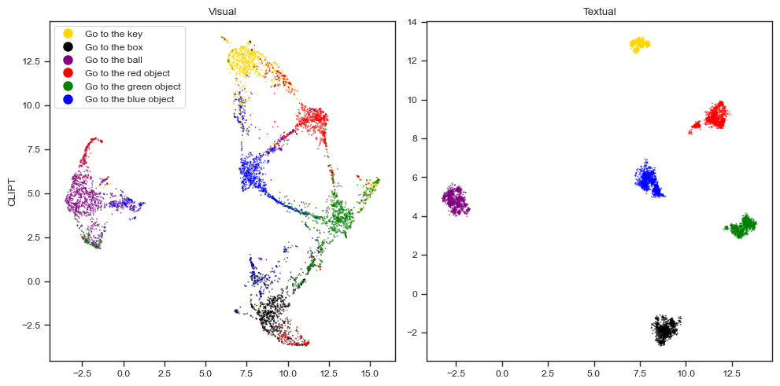
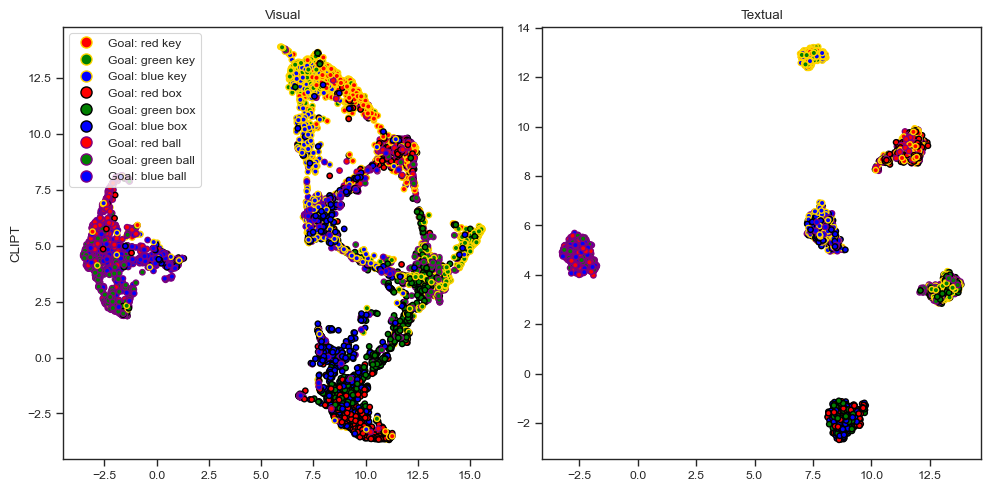

When [visualizing CLIPT embeddings](2023-08-15t11-54-42z.md), we do not
recognise clear distinctions between object and colour. For instance, the key
embeddings are closer to the color embeddings, rather than to the ball and box
embeddings.

Could this situation be improved by training a version of
[CLIPT](2023-07-10t16-36-37z.md) on more varied text data? We can obtained this
increase in variability by randomly paraphrasing our text inputs.

We train this version of CLIPT and repeat our process for visualizing the
embeddings, and obtain the following:

