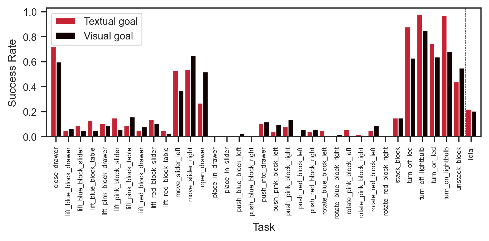

When training [[2023-07-11t10-17-09z|GCBC]], we expose the policy to sequences
of ~30 time steps, between 28 and 32.

However, when [[2023-07-11t10-52-26z|evaluating GCBC]], we allow the policy to
interact with the environment for up to 240 steps.

Given that GCBC is an [[2020-09-04t13-57-25z|RNN]], its hidden state is
maintained for all of these steps which is a requirement that it never had to
fulfil during training.

To account for this OOD requirement, we adjust evaluation such that the policy's
hidden state is reset every 28 steps. With this, we get the following results:

|           | **Textual Success Rate** | **Visual Success Rate** |
| :-------: | :----------------------: | :---------------------: |
| **count** |        34.000000         |        34.000000        |
| **mean**  |         0.412647         |        0.362353         |
|  **std**  |         0.285448         |        0.233602         |
|  **min**  |         0.050000         |        0.080000         |
|  **25%**  |         0.205000         |        0.172500         |
|  **50%**  |         0.270000         |        0.315000         |
|  **75%**  |         0.665000         |        0.530000         |
|  **max**  |         0.970000         |        0.790000         |

And without suggestive start states

|           | **Textual Success Rate** | **Visual Success Rate** |
| :-------: | :----------------------: | :---------------------: |
| **count** |        34.000000         |        34.000000        |
| **mean**  |         0.222353         |        0.205588         |
|  **std**  |         0.304651         |        0.258002         |
|  **min**  |         0.000000         |        0.000000         |
|  **25%**  |         0.040000         |        0.030000         |
|  **50%**  |         0.085000         |        0.085000         |
|  **75%**  |         0.240000         |        0.317500         |
|  **max**  |         0.980000         |        0.850000         |

Unfortunately the
[[2023-07-11t12-12-49z|Suggestive start states in GCBC Evaluation]] problem
remains.

At this point, I believe this may be due to

- the context is too long during _training_
- the policy is underparametrized for the complexity of the task

